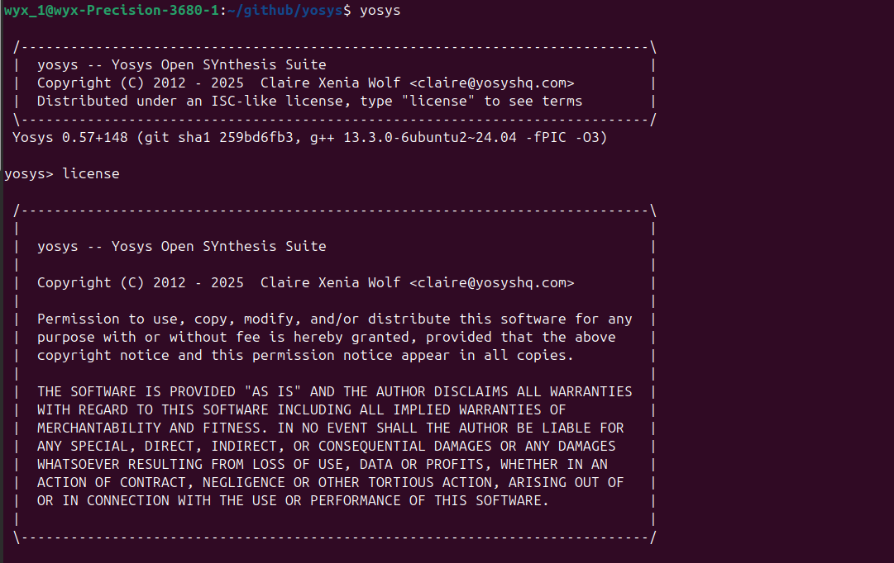
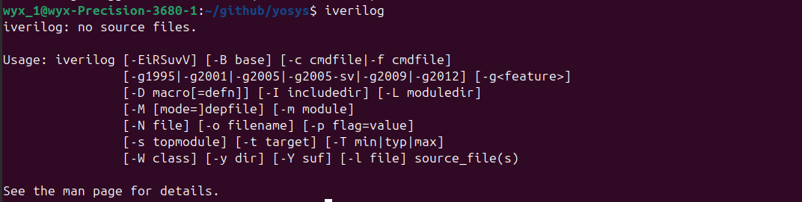
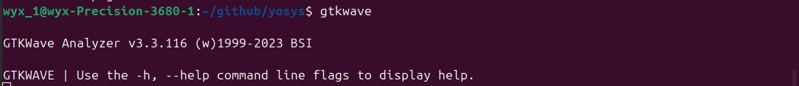
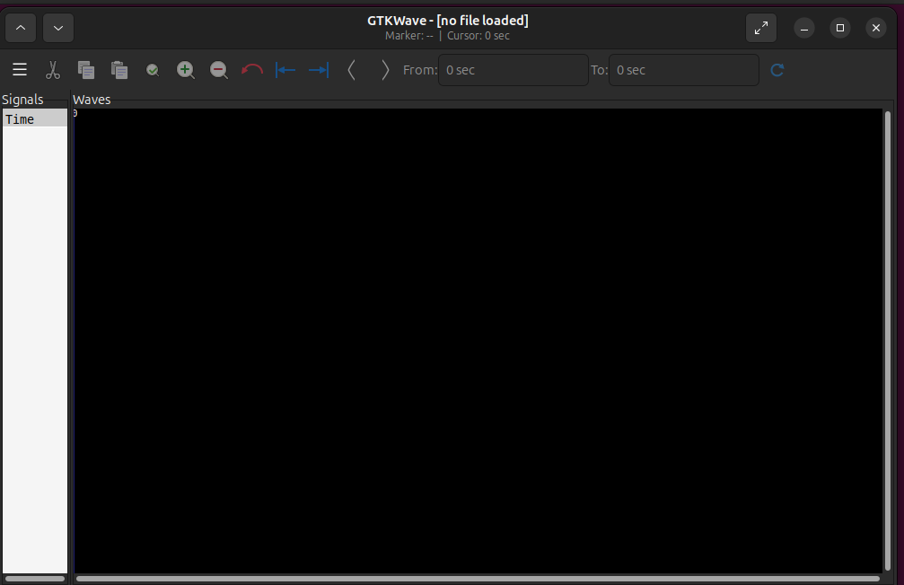

# RISCV_SoC_TapeOut_Week0
## Tools Installation
### Yosys
```bash
$ git clone https://github.com/YosysHQ/yosys.git
$ cd yosys
$ cd sudo apt install make
$ sudo apt-get install build-essential clang bison flex \
    libreadline-dev gawk tcl-dev libffi-dev git\
    graphviz xdot pkg-config python3 libboost-system-dev \
     libboost-python-dev libboost-filesystem-dev zlib1g-dev
$ make config-gcc
$ git submodule update --init
$ make
$ sudo make install
```

### Iverilog
```bash
$ sudo apt-get install iverilog
```

### GTKWave
```bash
$ sudo apt install gtkwave
```


